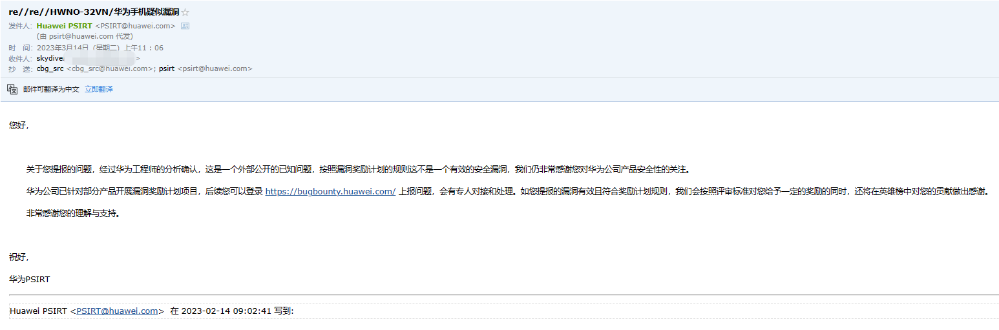

# WaterHole
## [vul-01](vul-01.md)
**一个SQL注入；其实这个鬼系统有一堆SQL注入，随便提交了一个用来水了个CVE-2022-2671。**
## [vul-02](vul-02.md)
**Huawei HarmonyOS 3 个人热点 ARP欺骗攻击，攻击可导致短时间内，攻击者可以截获被攻击者的互联网访问流量，比如DNS。**

很可惜，这次官方说是一个公开的已知问题，没能蹭到一个CVE。

