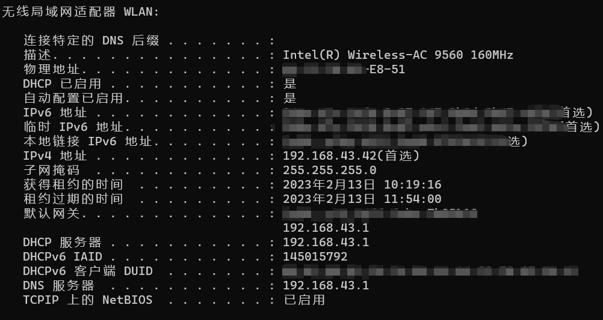

---

### 设备：Huawei P40 Pro（HarmonyOS 3.0.0.202）
 **攻击者与攻击目标接入同一个个人热点WiFi，攻击者运行ARP欺骗攻击，试图仿冒网关，观察是否可以截获被攻击者的流量。**

 **攻击效果：ARP攻击可导致短时间内，攻击者可以截获被攻击者的互联网访问流量，比如DNS。**
 

---

  网络环境信息：

    target硬件地址：xx:xx:xx:xx:e8:51

    attacker硬件地址：xx:xx:xx:xx:75:96

###### target网络信息

###### target网络信息及热点信息

###### attacker网络信息

---
#### 攻击运行后抓包观察attacker主机上的流量特征（ARP & DNS）

  **观察到attacker（xx:xx:xx:xx:75:96）发送虚假ARP响应。**

  **在attacker主机上抓取到来自target主机（xx:xx:xx:xx:e8:51）的DNS请求。**

---
#### 攻击运行后抓包观察target主机上的流量特征（ARP & DNS）

  **观察到target主机确实收到了来自attacker（xx:xx:xx:xx:75:96）的虚假ARP响应。证明此时网关上的ARP安全机制没有生效。**

  同时也观察到网关(xx:xx:xx:xx:7b:85)响应的正常ARP响应包。

  **观察到target主机早期一段时间的DNS请求确实发给了attacker（虚假网关xx:xx:xx:xx:75:96）**

  一段时间（很短）后，target的流量不再经过attacker主机（目的MAC地址变为真实网关MAC地址xx:xx:xx:xx:7b:85），从target主机上的arp表也可看出，网关的硬件地址已经固定为真实地址。

